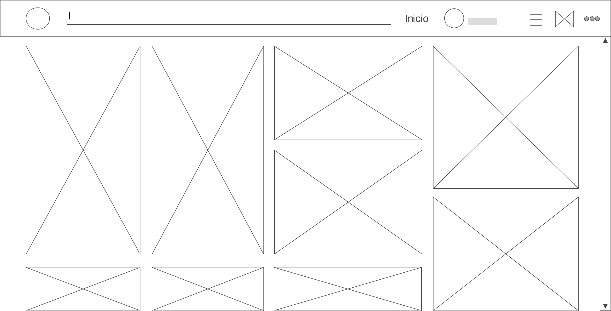

## UI

* Icono principal.
* Barra de busqueda.
* Barra de menú.
* Configuración.
* Boton de guardar.
* Boton de descargar.
* Barra de categorias.
* Notificaciones.
* Bandejas de entrada.

## UX

* Seleccion de imagenes.
* Imagenes recomendadas.
* Busquedas recientes.